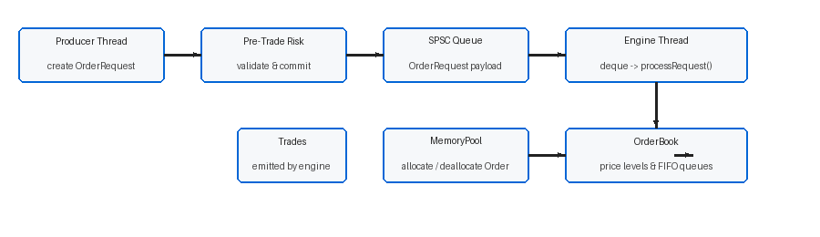
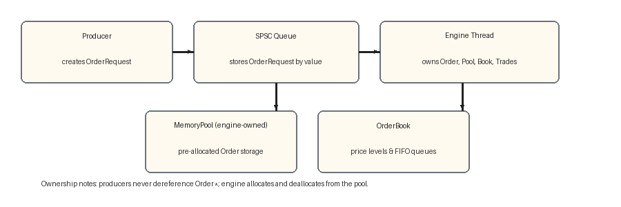

# Order Matching Engine

A C++17 price-time-priority limit order book matching engine built for low-latency systems engineering.


**p50 ≈ 487 ns · p99.9 ≈ 5.8 µs · 1.87M orders/sec (pinned) · zero per-order heap allocation**

---

## Contents

- [Overview](#overview)
- [Architecture](#architecture)
- [Features](#features)
- [Benchmark Results](#benchmark-results)
- [Build and Run](#build-and-run)
- [Design Tradeoffs](#design-tradeoffs)
- [Project Structure](#project-structure)

## Overview

This project implements a single-symbol central limit order book with `NEW`, `MODIFY`, and `CANCEL` semantics and a strict producer-consumer execution model. It demonstrates low-latency systems engineering: clear ownership boundaries between threads, a lock-free handoff path, and a reproducible cycle-accurate microbenchmark harness — built entirely on the C++ standard library and pthreads, with zero third-party dependencies.

A single producer thread validates and submits order requests. A single dedicated engine thread owns all book state, allocates from a compile-time memory pool, matches orders, and publishes completion signals the producer polls for precise round-trip latency measurement.

## Architecture





Producer threads create `OrderRequest` payloads, run pre-trade risk checks, and push them onto a lock-free SPSC queue. A single engine thread owns all book state, allocates `Order` objects from a compile-time memory pool, matches orders against the opposite side, and emits trades. Completion is signaled through a cache-line-isolated atomic `RequestId`, which the producer polls to measure true end-to-end latency.

## Features

- **Price-time priority matching** — deterministic matching by price level, then FIFO within each level via an intrusive doubly-linked list
- **Lock-free SPSC queue** — 64K-slot power-of-2 ring buffer with cache-line-aligned head/tail to prevent false sharing between threads
- **Compile-time memory pool** — `MemoryPool<Order, 1M>` eliminates per-order heap allocation on the engine hot path
- **Producer-side pre-trade risk validation** — token-bucket rate limiting and position limits in fixed-point integer arithmetic, executed before queue insertion
- **MODIFY semantics with priority rules** — quantity reduction preserves time priority; quantity increase or price change resets it
- **Thread affinity support** — `pthread_setaffinity_np` (Linux) / `SetThreadAffinityMask` (Windows) for benchmark reproducibility
- **Serialized TSC latency measurement** — LFENCE/RDTSC and RDTSCP/LFENCE with locally calibrated cycle-to-nanosecond conversion

## Benchmark Results

Results from a local run of the included benchmark harness — 1,000,000 orders, seed 42, distribution: 60% BUY LMT | 20% SELL LMT | 10% CANCEL | 10% MODIFY.

| Percentile | Unpinned (ns) | Pinned Core 2 (ns) |
|---|---|---|
| Mean | 649 | 504 |
| p50 | 487 | 344 |
| p95 | 875 | 744 |
| p99 | 1,119 | 994 |
| p99.9 | 5,828 | 7,254 |
| Max | 34,401,819 | 32,177,712 |

**Throughput:** 1,484,700 orders/sec unpinned · 1,873,962 orders/sec pinned

**Methodology:** Per-request polling via `lastProcessedRequestId()`. Timestamps captured with `LFENCE`/`RDTSC` at start and `RDTSCP`/`LFENCE` at end. Calibration: median of 7 `steady_clock` windows (250 ms each), 2.496 cycles/ns. Numbers are machine-dependent — reproduce locally using the included harness.


## Build and Run

### Linux

Prerequisites: CMake ≥3.16, GCC or Clang, Make.

```bash
git clone <repo-url>
cd "Low-Latency Limit Order Book Matching Engine"
mkdir -p build && cd build
cmake -DCMAKE_BUILD_TYPE=Release ..
make -j$(nproc)

./matching_engine   # interactive demo
./benchmark         # latency and throughput harness
```

Pinned benchmark run:

```bash
taskset -c 2 ./benchmark
```

### Windows

Prerequisites: CMake ≥3.16, Visual Studio 2022 (or MinGW).

```cmd
git clone <repo-url>
cd "Low-Latency Limit Order Book Matching Engine"
mkdir build
cd build
cmake -DCMAKE_BUILD_TYPE=Release ..
cmake --build . --config Release

.\Release\matching_engine.exe
.\Release\benchmark.exe > benchmark_run.txt
```

> Thread affinity and TSC timing are supported on both platforms; absolute latency numbers will vary by hardware and OS scheduler behavior.

## Design Tradeoffs

`std::map` is used for price levels. It allocates a heap node per price level and has O(log n) lookup — chosen to keep the prototype readable. In a production system with a fixed tick increment, a flat array indexed by `(price - base) / tick_size` would give O(1) level lookup with zero allocation; for a sparse price range, an open-addressing hash map would eliminate allocation variance instead.

The compile-time `MemoryPool<Order>` eliminates per-order heap allocation on the engine hot path. Other allocation sources remain — price-level map nodes and per-match trade output vectors — and are a known, intentional tradeoff of this prototype's design.

## Project Structure

```
.
├── benchmark/
│   └── bench.cpp              # TSC-calibrated latency/throughput harness
├── docs/
│   ├── architecture.md        # Component and data-flow deep dive
│   ├── benchmarking.md        # Measurement methodology
│   └── design-decisions.md    # Engineering tradeoffs and rationale
├── include/
│   ├── engine_thread.h        # MatchingEngine and engine thread orchestration
│   ├── memory_pool.h          # Compile-time fixed-capacity memory pool
│   ├── order.h                # Order struct (one cache line)
│   ├── order_book.h           # Price-level book and matching logic
│   ├── pre_trade_risk.h       # Producer-side risk validation
│   ├── spsc_queue.h           # Lock-free SPSC ring buffer
│   ├── timekeeper.h           # Cached nanosecond clock
│   ├── trade.h                # Trade record
│   └── types.h                # Core type aliases and OrderRequest
├── media/                     # Architecture diagrams and benchmark capture
├── src/
│   ├── engine_thread.cpp      # Engine loop and request processing
│   ├── main.cpp               # Interactive demo
│   └── order_book.cpp         # Matching engine core logic
├── CMakeLists.txt
└── README.md
```

For a deeper dive, see [`docs/architecture.md`](docs/architecture.md), [`docs/benchmarking.md`](docs/benchmarking.md), and [`docs/design-decisions.md`](docs/design-decisions.md).