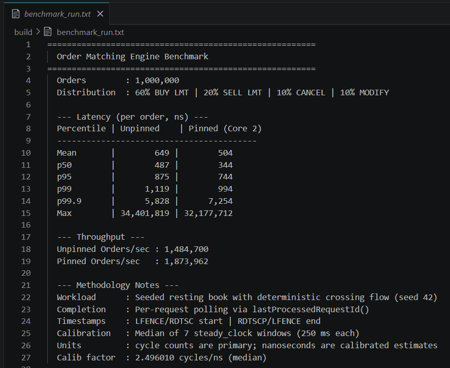

# Low-Latency Limit Order Book Matching Engine


Professional-grade documentation for a C++17 price-time-priority matching engine.

This repository is a focused systems-engineering portfolio project that demonstrates low-latency design, clear ownership boundaries, and reproducible microbenchmarks suitable for interview and recruiter review.

**Status:** Implementation complete — documentation, benchmarking and presentation polish.

---

**Project Overview**

- What the engine does: Implements a single-symbol, price-time-priority central limit order book (CLOB) with `NEW`, `MODIFY`, and `CANCEL` semantics and a producer-consumer execution model for low-latency matching.
- Why it was built: To demonstrate industry-minded systems engineering for quant trading roles — correctness, ownership, and measurable performance without external dependencies.
- Target use case: low-latency local benchmarking and systems-engineering experimentation. See `docs/benchmarking.md` for measurement methodology, calibration requirements, and hardware-specific results.
- Scope boundaries: No market connectivity, FIX/TCP gateways, persistent storage, or distributed systems — the repository intentionally focuses on a single-process matching core and its benchmarking.

---

**Key Features**

- **Price-Time Priority Matching** — deterministic matching by price levels, then FIFO within a level.
- **Producer-Consumer Architecture** — separate producer(s) that build and submit `OrderRequest` payloads and a single engine consumer that owns book state.
- **Lock-Free SPSC Queue** — single-producer single-consumer request queue for minimal handoff latency.
- **Compile-Time Memory Pool** — fixed-capacity `MemoryPool<Order>` to reduce hot-path heap allocations.
- **Producer-Side Risk Validation** — pre-trade checks executed before queue insertion to keep engine simple and fast.
- **Order Modification Support** — `MODIFY` semantics implemented as ordered updates that preserve price-time priority when possible.
- **Thread Affinity** — optional CPU pinning for benchmark reproducibility and cache locality.
- **Benchmark Framework** — Linux-first microbenchmark harness with warmup, serialized TSC timing, and percentile reporting.

---

**Architecture Overview**

Flow (simple):

Producer Thread
       |
PreTradeRiskCheck
       |
SPSC Queue<OrderRequest>
       |
Engine Thread
       |
MemoryPool<Order>
       |
OrderBook
       |
Trades (emitted)

Mermaid diagram:


### Architecture diagrams

High-quality SVG diagrams are included for recruiter-facing presentation:


If you want to attach a benchmark screenshot to the README, place a PNG at
`media/benchmark.png`. To generate a reproducible benchmark capture on Linux,
build and run the harness, redirect output to a file, and optionally convert
the text output into an image (ImageMagick) or take a terminal screenshot.

Example commands:

```bash
mkdir -p build && cd build
cmake -DCMAKE_BUILD_TYPE=Release ..
make -j$(nproc)
./benchmark > bench_output.txt
# Convert textual output to PNG (requires ImageMagick)
convert -background white -fill black -font DejaVu-Sans-Mono -pointsize 10 \
       label:@bench_output.txt ../media/benchmark.png
```

Or capture a live terminal screenshot with `scrot` or your desktop's screenshot tool and save it to `media/benchmark.png`.

This diagram mirrors the implementation: producers create lightweight `OrderRequest` objects, run local validation, and push them to the SPSC queue. The engine thread pulls requests, allocates an `Order` from the compile-time pool, updates the book, and records trades.

---

## Benchmark Results (template)

Add a short verified benchmark summary and a screenshot here after running the included harness on your target machine. Do NOT paste synthetic numbers. Replace `media/benchmark.png` with an actual capture of `./benchmark` output.

Example (replace placeholders with your verified values and hardware):

- **Machine:** <CPU model, e.g. Intel Xeon Xxxx>
- **Cores used (pinned):** <producer core>, <engine core>
- **Benchmark orders:** <N>
- **Mean / p50 / p95 / p99 / p99.9 / Max (ns):** <mean> / <p50> / <p95> / <p99> / <p99.9> / <max>
- **Pinned throughput (ops/sec):** <ops/sec>
- **Notes:** <any special settings e.g. governor, turbo, background load>



Replace the placeholder image by running the harness and converting the textual output to a PNG (see instructions below or in `docs/benchmarking.md`).

---

## Benchmark Reproducibility

When you publish benchmark numbers, include a short reproducibility snapshot so reviewers can interpret results. At minimum, capture the following fields and include them alongside the Benchmark Results entry above:

- **CPU model:** output of `lscpu | grep "Model name"` (Linux) or `wmic cpu get Name` (Windows)
- **Physical cores / threads:** `lscpu | grep "CPU(s):"` or `nproc --all`
- **RAM:** `free -h` or `wmic computersystem get TotalPhysicalMemory`
- **OS version:** `uname -a` and `/etc/os-release` (Linux) or `winver` / `systeminfo` (Windows)
- **Compiler & version:** `gcc --version` or `clang --version` (record exact output)
- **Build flags:** the `CMakeCache.txt` or `CMAKE_CXX_FLAGS` used for the Release build (record `-O3 -march=... -DNDEBUG` exact flags)
- **Affinity configuration:** which cores were pinned for producer and engine (e.g., `taskset -c 2 ./benchmark` or `pthread_setaffinity_np` core ids)
- **Benchmark command:** full command line used to run the harness (include warmup and run counts, e.g. `./benchmark --warmup=10000 --runs=100000`)

Commands to collect system snapshot (Linux example):

```bash
lscpu
cat /proc/cpuinfo | grep 'model name' | uniq
free -h
uname -a
gcc --version
cat /etc/os-release
# Build flags
cd build && grep CMAKE_CXX_FLAGS CMakeCache.txt || echo "inspect CMakeLists.txt"
```

Include this snapshot with any benchmark screenshot or pasted benchmark table so readers can interpret the numbers reliably.

---

**Order Lifecycle (NEW / MODIFY / CANCEL)**

- NEW: Producer constructs `OrderRequest(NEW)`, validates, pushes to the queue. Engine dequeues, allocates an `Order` from `MemoryPool`, inserts into `OrderBook` at price level (creates level if needed), and attempts matching against opposite side. Trades are created and appended to the trade buffer.
- MODIFY: Producer sends a `MODIFY` `OrderRequest` (targeting a previously-known order id or client-local reference). The engine locates the live `Order` and applies changes. Price-change semantics remove/reinsert to correct level while preserving time ordering rules where appropriate.
- CANCEL: Producer sends a `CANCEL` `OrderRequest`. The engine locates the `Order` (via an index mapping from `OrderId` → `(Side, Price)`), then scans the corresponding price level's FIFO container to locate and remove the `Order*`, returns the slot to the `MemoryPool`, and emits completion metadata. Note: this removal is linear in the number of orders at that price level; O(1) removal can be achieved by storing a level iterator in the `Order` or using an intrusive list.

Completion and latency measurement are request-centric: the producer may poll `lastProcessedRequestId()` or equivalent completion token to detect when its request was handled by the engine thread.

---

**Memory Ownership Model**

- `Order` objects: owned exclusively by the engine thread and allocated from `MemoryPool<Order>`.
- `MemoryPool`: statically sized pool (compile-time parameter) owned by the engine and returned to by the engine on cancel/expiry.
- `Trades`: produced and owned by the engine thread; consumer code may snapshot or serialize them if needed.
- Queue payload (`OrderRequest`): owned by the producer while being prepared and then copied (or moved) into the SPSC queue; once dequeued, the engine owns the logical processing of that request.

---

**Concurrency Model**

- Single producer thread (or a controlled single-producer path) writes requests into the SPSC queue after running pre-trade checks.
- Single consumer engine thread owns all mutable book state; it performs all allocations from the memory pool and emits trades.
- Synchronization: lock-free SPSC queue for handoff; atomic completion tokens or request-id publication for producer confirmation. No fine-grained locks on book structures in the hot path.

---

**Benchmark Methodology (summary)**

- Warmup: run a configurable warmup (default: 10k requests) to stabilize caches and branch predictors.
- Serialized TSC: uses LFENCE/RDTSC at the start and RDTSCP/LFENCE at the end on x86 to form cycle-level durations that are safe against out-of-order execution.
- Completion polling: the producer submits a request, then polls `lastProcessedRequestId()` (or a completion token) to detect processing completion; this keeps producer and consumer separated while allowing per-request latency measurement.
- Metrics: report mean, p50, p95, p99, p99.9, max, plus throughput (requests/sec). Use calibrated TSC cycle counts as the canonical measurement; convert cycles to nanoseconds only via a local calibration step and treat converted nanoseconds as calibrated estimates. Whenever possible, publish raw cycle counts, the calibration factor/method, and a short system snapshot to aid interpretation.

Rationale: this approach gives reproducible microbenchmark latencies while avoiding special-case kernel tracing tooling.

---

**Performance Considerations**

- Cache lines & padding: data structures in the hot path are sized/aligned to avoid false sharing between producer and engine threads.
- False sharing: avoid adjacent-modified-by-different-threads memory within a cache line; use padding where appropriate.
- Lock-free SPSC queue: reduced handoff latency compared to locks or MPMC structures; simpler memory ordering requirements.
- Memory pools: reduce per-order heap allocations and fragmentation that increase latency variance.
- Thread affinity: pin engine and producer threads to separate physical cores to reduce scheduler jitter and improve cache locality.

---

**Trade-offs / Out-of-scope (intentional)**

Not implemented on purpose:
- FIX, TCP gateways, or network protocols — out of scope for single-process microbenchmarks.
- Exchange connectivity, market data integrations, or persistent order store.
- Full allocation-free design (the current design mixes pool allocation for `Order` with standard containers for clarity and maintainability).

Why: these features add significant scope and operational complexity while distracting from the project's core goals: deterministic matching logic, ownership boundaries, and reproducible microbenchmarks.

---

**Build Instructions (Linux-first)**

Prerequisites: `cmake` (>=3.10), a modern GCC/Clang toolchain, `make`.

Example (recommended reproducible flow):

```bash
git clone <repo-url>
cd "Low-Latency Limit Order Book Matching Engine"
mkdir -p build && cd build
cmake -DCMAKE_BUILD_TYPE=Release ..
make -j$(nproc)
# Run engine (example)
./matching_engine
# Run benchmark harness
./benchmark
```

For pinned benchmark runs (Linux `taskset`):

```bash
# pin producer to CPU 2 and engine to CPU 3 for a two-process benchmark harness
taskset -c 2 ./matching_engine &
taskset -c 3 ./benchmark
```

Notes: For best reproducibility, use a dedicated CPU core set, disable frequency scaling, and minimize background processes.

---

**Repository Structure (key files)**

- `CMakeLists.txt` — build configuration.
- `README.md` — this file (high-level introduction and quick start).
- `include/` — public headers for engine components:
  - `types.h` — basic type aliases and constants.
  - `order.h` — `Order` and order identity types.
  - `trade.h` — `Trade` struct and trade recording helpers.
  - `memory_pool.h` — compile-time capacity memory pool implementation.
  - `spsc_queue.h` — lock-free SPSC queue code.
  - `pre_trade_risk.h` — producer-side risk checks.
  - `order_book.h` — order book data structures and matching logic.
  - `engine_thread.h` — engine thread orchestration.
- `src/` — implementation files:
  - `order_book.cpp` — matching engine core logic.
  - `engine_thread.cpp` — engine loop and request processing.
  - `main.cpp` — binary entry points for engine and benchmark.
- `benchmark/bench.cpp` — benchmark harness and measurement utilities.

For a detailed breakdown see the architecture and design docs in `docs/`.

---

**Future Enhancements (realistic)**

- Add an optional, isolated allocation-free data path for extreme microbenchmarks.
- Add an offline serializer to export real trades and book snapshots for post-run analysis.
- Expand benchmark harness to include multi-producer scenarios (with appropriate queue changes) and structured CI benchmarking.

---

See the `docs/` folder for deep-dive architecture, benchmarking, and interview-prep materials:

- [docs/architecture.md](docs/architecture.md)
- [docs/benchmarking.md](docs/benchmarking.md)
- [docs/design-decisions.md](docs/design-decisions.md)
- [docs/recruiter-summary.md](docs/recruiter-summary.md)
- [docs/interview-guide.md](docs/interview-guide.md)
- [docs/github-optimization.md](docs/github-optimization.md)

---

If you want, I can now:
- run a quick pass to polish example commands or add badges and a screenshot to the repository front page.
- generate a short `CONTRIBUTING.md` and `CHANGELOG.md` for release readiness.


